# Darts Atlas for Broadcasters

[hello@dartsatlas.com](mailto:hello@dartsatlas.com)

Darts Atlas ([dartsatlas.com](https://www.dartsatlas.com)) provides a full-service digital scoreboard for broadcasting steel-tip darts. A single platform provides simple match setup, scorekeeping, stat tracking, public scoreboards, and a suite of broadcasting tools to bring you everything you need to produce a professional, engaging, and informative program.

- Select from a number of scoreboard variants
- Set up all of your screens for a new match in under 30 seconds
- Run a league or tournament with automatically-updated leaderboards, brackets, and stats
- Create individual exhibition matches and invite players to join
- View detailed match data from the broadcast booth

Want to dive right in? **[Check out our Broadcasting Guide](/guide)**, which provides configuration details and examples for 4 Scenes and 9 distinct Sources in OBS.

See the Darts Atlas broadcast experience in-action on the City League Darts YouTube channel at [watch.cityleaguedarts.com](https://watch.cityleaguedarts.com).

Read on to learn more about what Darts Atlas can do for your production.

## Scoreboards

### 501 Single-Board

Each turn's score appears as a pop-out to the left of the thrower's name.

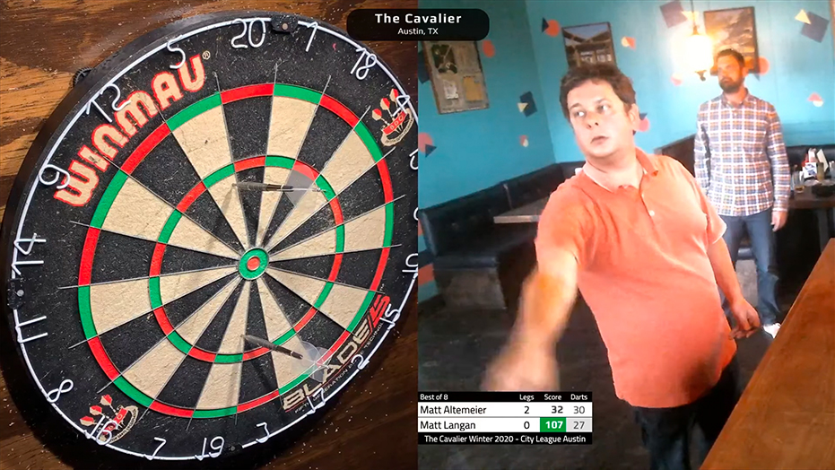

---

### 501 Dual-Board

Each turn's score appears as an overlay atop the player's required score.

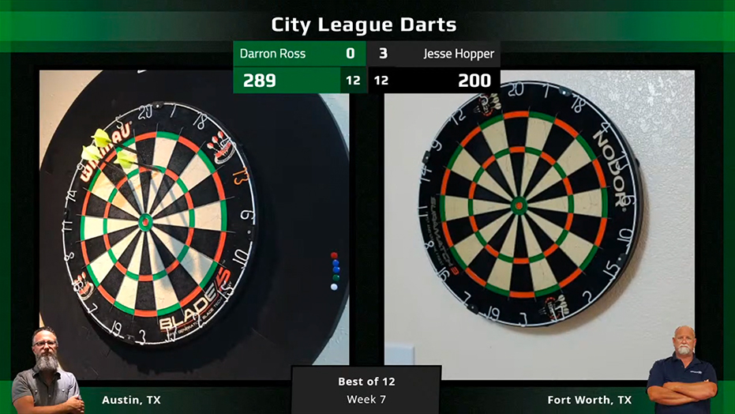

---

### 501 Standard

The standard live scoreboard can also be embedded to display each player's turns in the current leg.

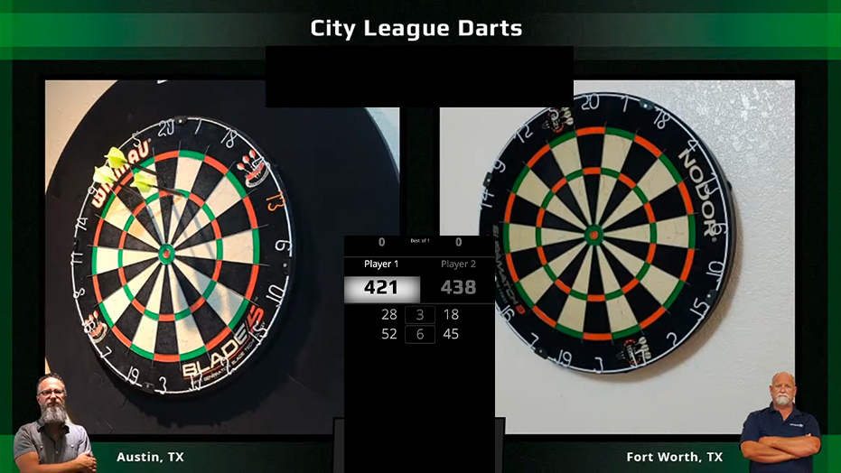

---

### Cricket Standard

Our standard live scoreboard, but for Cricket. If you're into that sort of thing.

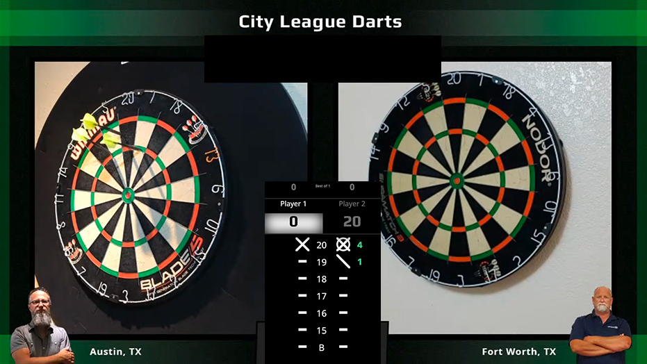

---

## Other Screens

### Broadcast Booth

The Broadcast Booth is meant to be the broadcaster's view into the match. Designed to be displayed full-screen in a secondary monitor beside your video feed(s), the booth offers valuable insights and full leg history for your match. If the match is part of a season then the players' season standings and stats will be rendered at the top. The live scoreboard is embedded on the left side of the screen, while the right side contains leg counts and match stats.

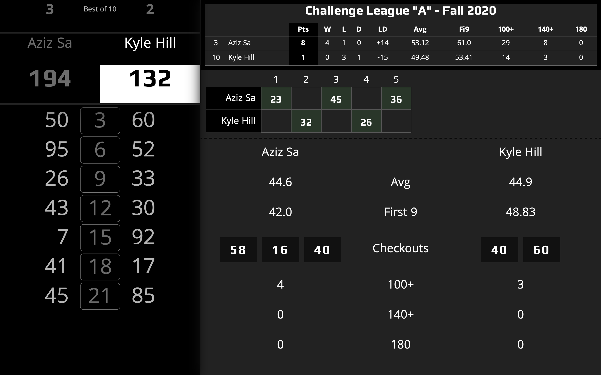

---

### Season Standings

A special standings-only screen is available to show the leaderboard, which is updated after each match.

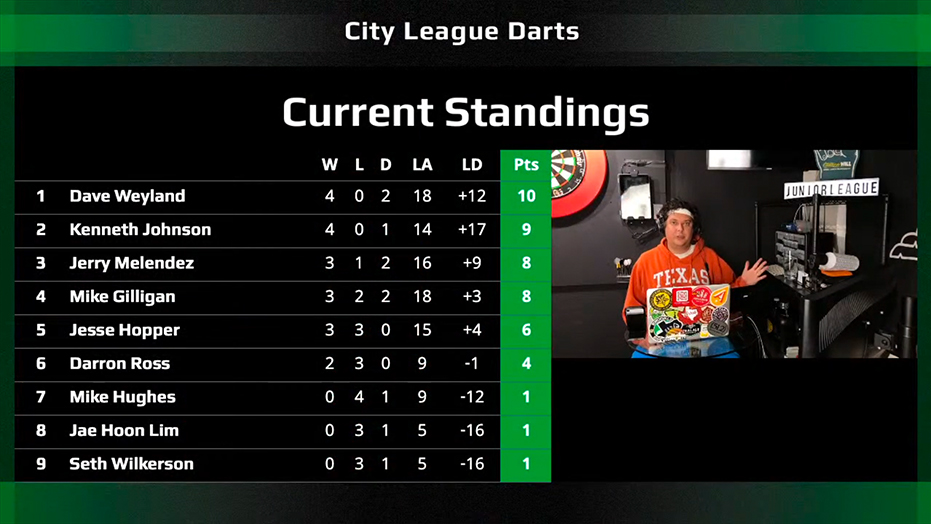

---

## Season Schedule

A special schedule-only screen is available to show the next 7 days of scheduled matches.

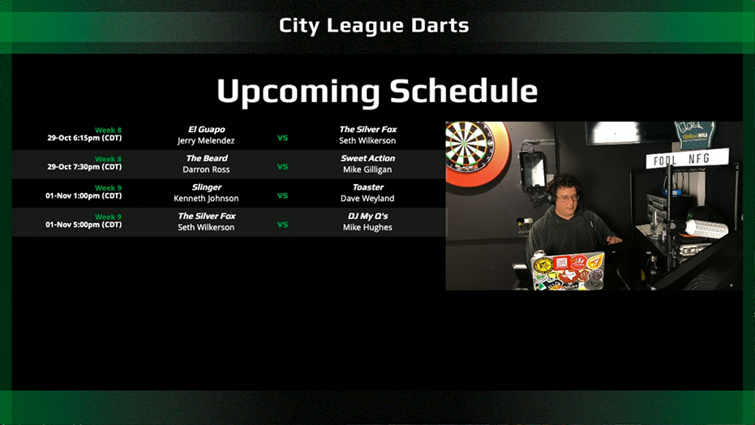

---

### Match Preview

Season matches include a preview screen that shows the player season stats in an easy-to-read side-by-side format.

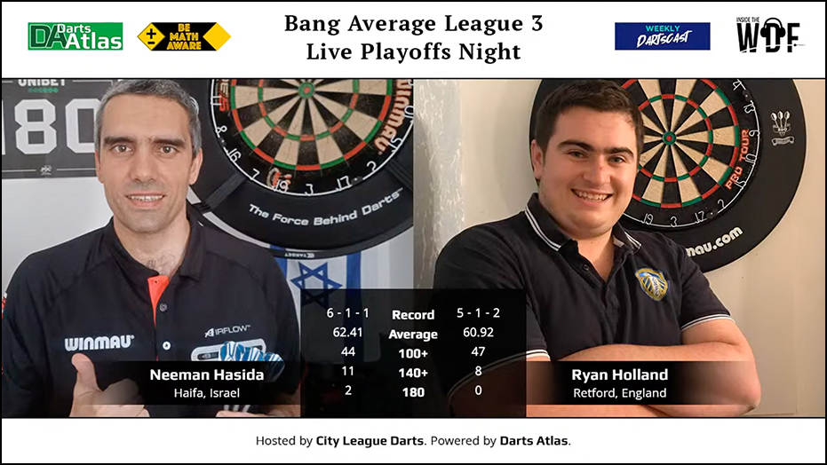

---

### In-Match Stats

Display realtime match stats, updated after each throw.

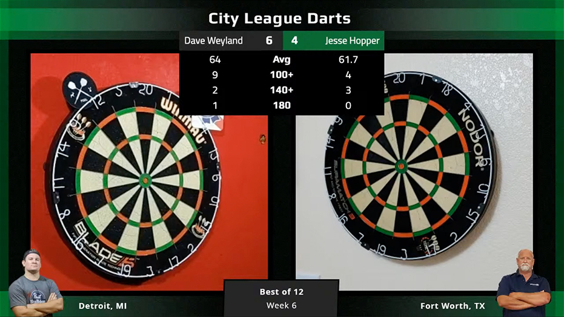

---

## Match Summary

Display summarized match stats. Separate stat recap and leg count sources can be used at the producer's discretion.

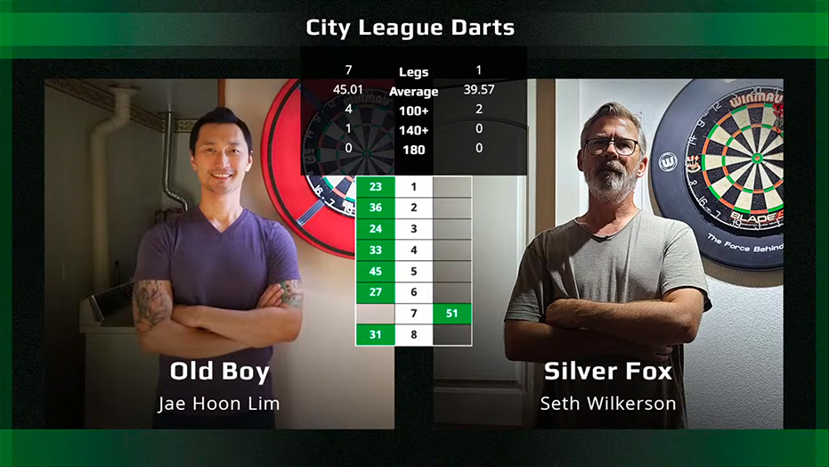

---

## Match Creation

Easily set up a singles or doubles match and invite your players to join.

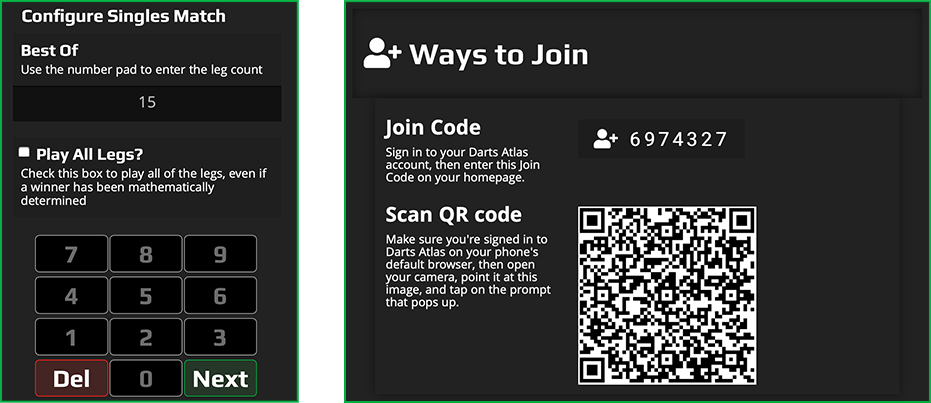

---

## Custom Branding

We are in the early process of documenting and expanding support for branded and customized in-game screens.

---

## Guide

[broadcast.dartsatlas.com/guide](/guide)

## Roadmap

- Player photo generation for match previews
- Controllabe slide-out animations for scoreboard stats
- Season schedule scene
- 1080x1920 configuration settings

## Contact Darts Atlas

- [hello@dartsatlas.com](mailto:hello@dartsatlas.com)
- [twitter.com/dartsatlas](https://www.twitter.com/dartsatlas)
- [facebook.com/dartsatlas](https://www.facebook.com/dartsatlas)

